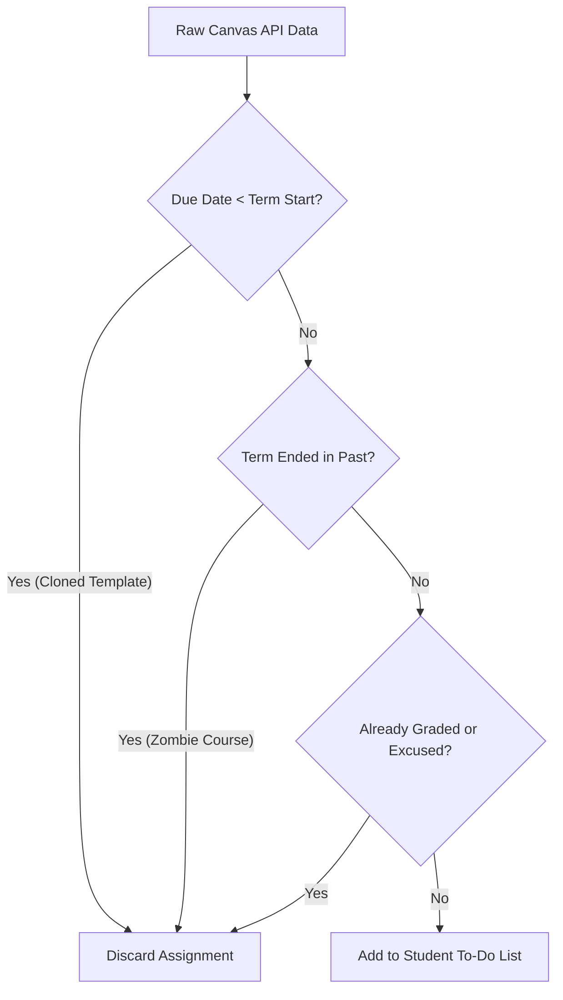
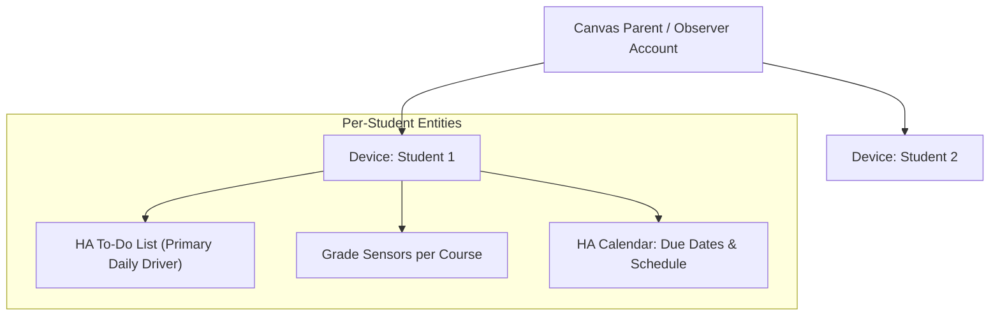

# Canvas LMS Home Assistant Integration Plan

This document outlines the architecture, data modeling, noise filtering, and practical support strategies for integrating Canvas LMS into Home Assistant to support high school students.

---

## 1. Goals & Core Approach

- **Actionable, Interactive To-Do Management:** Centered around Home Assistant's native **To-Do Platform (`todo`)**, allowing parents and students to review upcoming tasks and manually check off in-class, physical, or completed assignments without waiting on teacher grading cycles.
- **Dual-Student Visibility:** Seamlessly track both students independently under a single parent/observer account with dedicated devices.
- **Current Term Academic Health:** Monitor current quarter/semester letter grades and percentage scores for active enrolled courses.
- **Data Cleansing & Noise Filtering:** Eliminate false alarms caused by teachers importing old course templates with historical due dates (e.g., 2023–2025).
- **Conservative Resource Usage:** Poll Canvas on a 60-minute interval to respect API rate limits.

---

## 2. Real-World API Insights & Data Cleansing Rules

Real-world testing against high school Canvas instances revealed common data artifacts that require filtering:

### Filtering Heuristics

1. **Term Start-Date Boundary:** Any assignment with `due_at < term.start_at` (or `course.start_at`) is discarded as an unadjusted syllabus template from a prior year.
2. **Active Term Filtering:** Only track courses whose academic term is currently active (`term.start_at <= now <= term.end_at`).
3. **Graded / Excused Exclusion:** Discard items where `score is not None` or `excused == True`.
4. **Zero-Point Placeholders:** Discard assignments with `points_possible == 0` and no grading requirement.

---

## 3. Home Assistant Entity & Device Architecture

### A. Device Hierarchy

- The integration queries `/api/v1/users/self/observees` during setup and creates a distinct **Device** in Home Assistant for each linked student (e.g., `Student 1`, `Student 2`).

### B. Entities Created Per Student

| Entity Type              | Entity ID Pattern                 | Purpose & Features                                                                                                                                                |
| :----------------------- | :-------------------------------- | :---------------------------------------------------------------------------------------------------------------------------------------------------------------- |
| **To-Do List (Primary)** | `todo.<student>_assignments`      | **Interactive daily checklist.** Surfaces upcoming due items and past-due work. Parents/students can check off items locally when completed in class or on paper. |
| **Course Grade Sensors** | `sensor.<student>_<course>_grade` | High-level term academic health. State is current grade percentage (e.g., `92.5%`), with attributes for letter grade (`A-`), course code, and teacher.            |
| **Calendar**             | `calendar.<student>_assignments`  | Visual schedule of assignment deadlines and school events plotted on the family calendar.                                                                         |

---

## 4. To-Do List Workflow & Local Completion State

High school students frequently finish assignments in class (e.g. music playing tests, oral presentations, or "Do Now" prompts) or submit on physical paper.

To prevent false alarms:

1. **Syncing Down:** Canvas assignments within the active term are pulled into the student's HA To-Do list as `needs_action`.
2. **Local Check-off:** When a student confirms work is done, checking it off in Home Assistant moves the item to `completed`.
3. **State Persistence:** The integration persists locally completed item IDs so subsequent 60-minute polling cycles do not resurrect completed items.

---

## 5. Practical Automation & Support Strategies

With these entities in place, automations can be built around the interactive To-Do list and grade sensors:

### Strategy 1: Daily After-School Homework Briefing (e.g., 4:00 PM)

- **Trigger:** Time is 4:00 PM (Monday – Friday).
- **Condition:** `todo.<student>_assignments` has items still marked `needs_action` due today or tomorrow.
- **Action:** Announce via smart speaker (TTS) or send a mobile notification: _"Student 1 has 2 assignments remaining for tomorrow: English Essay and Math Worksheet."_

### Strategy 2: Grade Health Monitor

- **Trigger:** Any `sensor.<student>_*_grade` changes state.
- **Condition:** Grade drops below a specified threshold (e.g., `< 75%`).
- **Action:** Send a subtle alert to check in early and offer support before grading periods close.

### Strategy 3: Family Dashboard

- A dedicated dashboard card showing each student's:
  1. Active interactive To-Do checklist for today/this week.
  2. Course grade overview cards.
  3. Upcoming calendar view.
