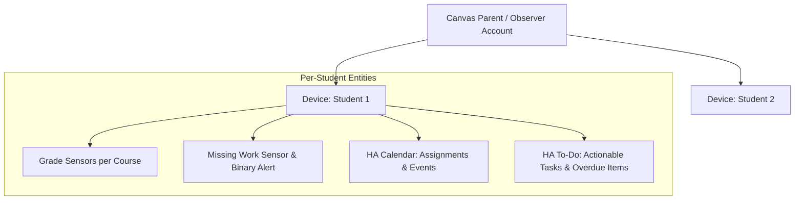

# Canvas LMS Home Assistant Integration Plan

This document outlines the architecture, data modeling, and practical support strategies for integrating Canvas LMS into Home Assistant to support high school students.

---

## 1. Goals & Integration Priorities

- **Dual-Student Visibility:** Seamlessly track both students independently under a single parent/observer account.
- **Current Term Academic Health:** Monitor current quarter/semester letter grades and percentage scores for all active enrolled courses.
- **Proactive Missing Work Tracking:** Provide immediate visibility into overdue and unsubmitted assignments before grades are impacted.
- **Actionable Deadlines & Workflow:** Offer both a **Calendar** view (for scheduling) and a **To-Do Checklist** (for tracking daily actionable tasks).
- **Conservative Resource Usage:** Poll Canvas on a 60-minute interval to respect API rate limits.

---

## 2. Home Assistant Entity & Device Architecture

### A. Device Hierarchy

- The integration queries `/api/v1/users/self/observees` during setup and creates a distinct **Device** in Home Assistant for each linked student (e.g., `Student 1`, `Student 2`).

### B. Entities Created Per Student

| Entity Type              | Entity ID Pattern                          | State                              | Key Attributes / Features                                                                 |
| :----------------------- | :----------------------------------------- | :--------------------------------- | :---------------------------------------------------------------------------------------- |
| **Course Grade Sensors** | `sensor.<student>_<course>_grade`          | Current Grade % (e.g., `92.5`)     | Letter grade (e.g., `A-`), Course code, Term name, Score calculation mode.                |
| **Missing Work Counter** | `sensor.<student>_missing_assignments`     | Count of missing items (e.g., `2`) | Detailed list of missing assignments (name, course, due date, points, direct Canvas URL). |
| **Missing Work Alert**   | `binary_sensor.<student>_has_missing_work` | `on` / `off`                       | Simplifies triggering automations whenever unsubmitted work exists.                       |
| **Calendar**             | `calendar.<student>_assignments`           | Next upcoming assignment           | All assignments, quizzes, and project deadlines plotted across the schedule.              |
| **To-Do List**           | `todo.<student>_assignments`               | Number of incomplete tasks         | Actionable checklist in Home Assistant, with overdue items clearly flagged.               |

---

## 3. Data Model & Rich Attributes

Every assignment surfaced in Home Assistant (in attributes, calendar events, and to-do lists) will carry rich context:

- **Assignment Title** (e.g., _"Chapter 4 Chemistry Lab Report"_)
- **Course Name & Code** (e.g., _"AP Chemistry (CHEM-101)"_)
- **Due Date & Time**
- **Points Possible**
- **Submission Status** (e.g., _Unsubmitted_, _Missing_, _Late_)
- **Direct Canvas URL** (Clickable link directly to the assignment page on Canvas)

---

## 4. Practical Automation & Support Strategies

With these entities in place, automations can be built in Home Assistant using standard helpers and the Home Assistant Companion App:

### Strategy 1: Missing Assignment Notification

- **Trigger:** `binary_sensor.<student>_has_missing_work` changes from `off` to `on`.
- **Action:** Send a notification to parent phones with the list of missing items and links to Canvas.

### Strategy 2: Daily After-School Homework Briefing (e.g. 4:00 PM)

- **Trigger:** Time is 4:00 PM (Monday – Friday).
- **Condition:** `todo.<student>_assignments` has items due today or tomorrow.
- **Action:** Announce via smart speaker (TTS) or send a mobile notification: _"Student 1 has 2 assignments due tomorrow: English Essay and Math Worksheet."_

### Strategy 3: Grade Health Monitor

- **Trigger:** Any `sensor.<student>_*_grade` changes state.
- **Condition:** Grade drops below a specified threshold (e.g., `< 75%`).
- **Action:** Send a subtle alert so you can check in early and offer help before report cards.

### Strategy 4: Family Tablet Dashboard View

- A dedicated dashboard view with a tab or column for each student showing their current grade cards, an upcoming deadline calendar, and their active to-do list.
